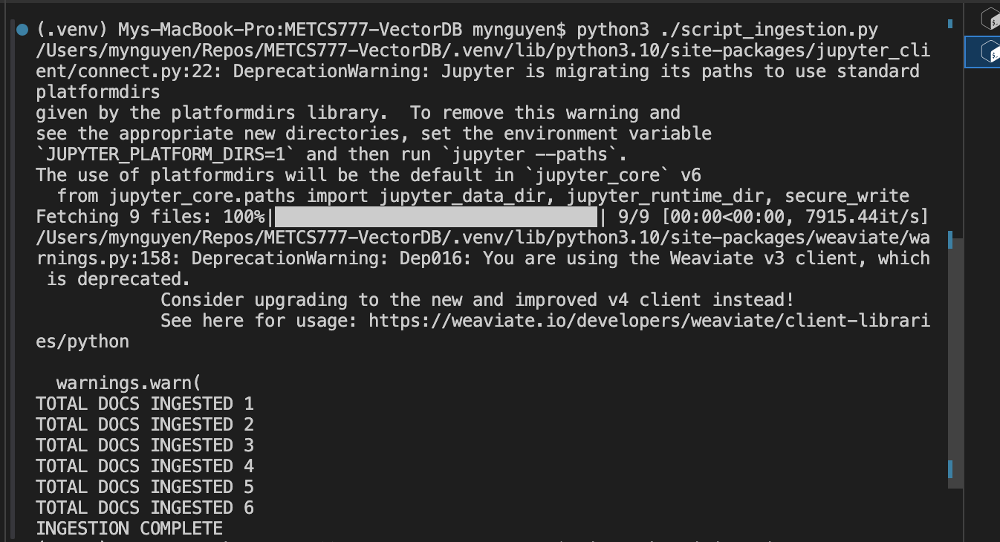
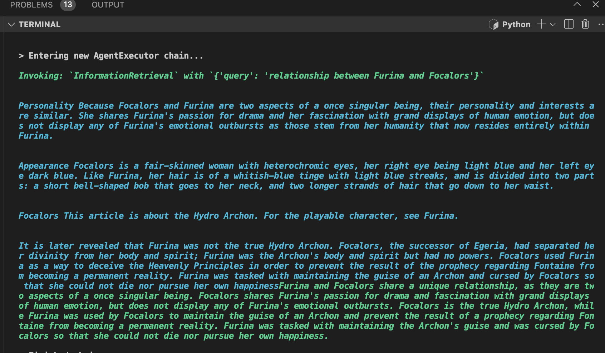
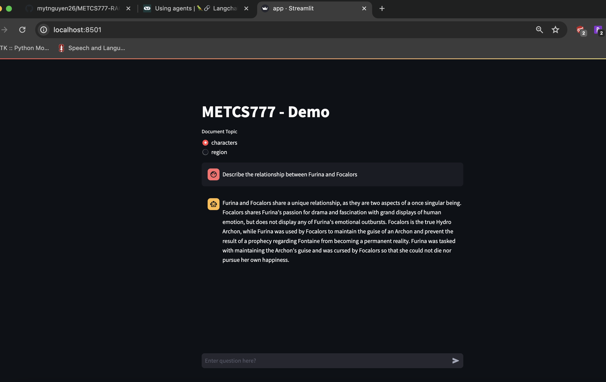

# METCS777-VectorDB
This is a repository for term project implementation for METCS777. This is a RAG application with Weaviate vector database


### What is RAG
Retrieval Augement Generation is a framework that allows LLM backed application to have access to updated, proprietory data that the underlying model was not trained with. This pattern has 3 main components:

- `Retrieval` - powered by Vector Search or a Vector Database. In this process user's `query` is used to search to similar documents or document chunks. The user's `query` is first encoded by an Embedding Model (which is the same as the Embedding Model used in creating vector embeddings stored in Vector Database) and turned into vector embeddings. Next a Vector Search Algorithm is performed (which is either an exhaustive-KNN or ANN) to find `top-k` vectors that have distance closest to the input

- `Augmentation`: retrieved documents chunks from `Retrieval` process are added to the System prompt, along with the user's original query to create a final Prompt

- `Generation`: the final Prompt is sent to an LLM (such as OpenAI) for text generation

### The data
For this project, I used data scrapped from a public site https://genshin-impact.fandom.com/wiki/Genshin_Impact_Wiki. This is similar to wikipedia but specific to the game Genshin Impact. The data extracted in used in building the Vector Database is saved in `./data`

This data is then parsed, embedded and ingest to a Weaviate instance, class `Document` by running a the script `script_ingestion.py` at the root of this folder. After running this script, you should see the following in the terminal



and you now can interact with the data in the Weaviate instance with the notebook `vectordb_search.ipynb`

Note that: make sure you set all your `.env` follow the examples in `.env.example`

### The result
There are 2 ways you can see how Weaviate works with the data ingested, discussed above
#### 1. Using the setup notebook
In `vectordb_search.ipynb`, you see some examples I have setup

The schema would looks something like below. A few important thing to highlight
- `class = "Document"`: this is where all the data is stored and organized in Weaviate.
- properties: these are the `metadata` associated with each chunk of document, such as `topic`, `doc_name`,`source`. Each metadata has 2 associated Inverted Index configuration, `indexFilterable` and `indexSearchable`. These index are important for Search optimization. In Weaviate, next to each Shard (basically where the data are stored together in the memory space) are two types of index, Inverted Index and hnsw Index. During search, the engine relies on these two to quickly retrieve the result without loosing a lot of accuracy (or recall).
  - `indexFilterable` allow pre-filtering to happen
  - `indexSearchable` allow bm25 search to happen

- `vectorIndexType': 'hnsw'` is a type of vector index used in search
- `'distance': 'cosine'` is the scoring used to compute similarity between the 2 vectors

```
{'classes': [{'class': 'Document',
   'description': 'This is a class to store Document chunks',
   'invertedIndexConfig': {'bm25': {'b': 0.75, 'k1': 1.2},
    'cleanupIntervalSeconds': 60,
    'stopwords': {'additions': None, 'preset': 'en', 'removals': None}},
   'multiTenancyConfig': {'enabled': False},
   'properties': [{'dataType': ['text'],
     'description': 'Chunk of document content',
     'indexFilterable': False,
     'indexSearchable': False,
     'name': 'text',
     'tokenization': 'word'},
    {'dataType': ['text'],
     'description': 'topic of this document',
     'indexFilterable': True,
     'indexSearchable': False,
     'name': 'topic',
     'tokenization': 'word'},
    {'dataType': ['text'],
     'description': 'title of this document',
     'indexFilterable': False,
     'indexSearchable': True,
     'name': 'doc_name',
     'tokenization': 'word'},
    {'dataType': ['text'],
     'description': 'location of this document',
     'indexFilterable': False,
     'indexSearchable': False,
     'name': 'source',
     'tokenization': 'word'}],
   'replicationConfig': {'factor': 1},
   ...
    'bq': {'enabled': False}},
   'vectorIndexType': 'hnsw',
   'vectorizer': 'none'}]}

```

when `semantic_search_with_filter(client, embeddings.embed_query("Who is Furina"), "characters")` is ran, we got the chunks of documents back. In this query, the input query is `Who is Furina`, and the search engine must only search in the `properties = characters`

```
"Document": [
      {
         "_additional": {
            "distance": 0.24088764,
            "explainScore": "",
            "score": "0"
         },
         "source": "../data/characters/Furina.txt",
         "text": "Furina Furina de Fontaine[1][2] is a playable Hydro character in Genshin Impact who can alternate between Pneuma and Ousia alignments.",
         "topic": "characters"
      },
      {
         "_additional": {
            "distance": 0.24376959,
            "explainScore": "",
            "score": "0"
         },
         "source": "../data/characters/Furina.txt",
         "text": "Appearance See also: Coronated Prima Donna Furina is a fair-skinned girl who uses the medium female model. Her eyes are heterochromatic in shades of blue. She has soft white hair with light blue streaks. Arkhe alignments cause changes in Furina's features.",
         "topic": "characters"
      },
   ...
]
```

Vice versa, if we search the same query, but in a different properties `properties = region` , using this query `semantic_search_with_filter(client, embeddings.embed_query("Who is Furina"), "region")` we get a different set of answer, which is expected of course.

```
"Document": [
   {
      "_additional": {
         "distance": 0.3319096,
         "explainScore": "",
         "score": "0"
      },
      "source": "../data/region/Fontaine.txt",
      "text": "Furina's birthday is a public holiday in Fontaine; although no longer the ruling Hydro Archon, her birthday remains a holiday. [22]",
      "topic": "region"
   },
   {
      "_additional": {
         "distance": 0.41404307,
         "explainScore": "",
         "score": "0"
      },
      "source": "../data/region/Fontaine.txt",
      "text": "~499 years later, she was sentenced to death via the Oratrice, and has willingly given up her full authority as the Hydro Archon to the Hydro Dragon Sovereign, thus clears the people of Fontaine from their 'Original Sin', and making them - including Furina - fully human. As the result, the Hydro Archon throne is destroyed - hence there will be no further Hydro Archons and the Oratrice is no longer can be used - and the people of Fontaine can no longer can dissolved by the Primordial Sea water. Due to the extreme exhaustion and stress she endured for the last 499 years, Furina leaves the Palais Mermonia and Opera Epiclese, where she settles down in an apartment. [25] ? years ago Karl, Rene, and Jakob explore the Khaenri'ahn ruins in Vourukasha Oasis and Madinat al-Nuhas, guided by the Order of Skeptics. During the trip, Jakob's weak constitution caused his health to deteriorate. Unbeknownst to Karl, Rene went behind his back and used Abyssal power to save Jakob. During this trip, they also deduce the \"world-formula\" from the records they found in the ruins, predicting a second flood period which would destroy Fontaine in the next few centuries. Jakob and Rene return to Fontaine and soon discover Elynas' remains. They begin conducting secret experiments on the remains, namely by having Jakob absorb Elynas' blood. After some time, he became able to survive without eating by subsisting mainly on Elynas' flesh.",
      "topic": "region"
   },
   ...
]

```

In both answers, we also see the `distance`, which in weaviate is between 0 and 2. It is calculated as
```
1 - cosine_score
```

The closer it is to 0, the more similar it is to the input query `Who is Furina`.
As we can see, different filter enabled allows us to really narrowly search a cluster of shard, and yields different result. Therefore, we should think very critically which properties do we enabled as filters in order to yield the best balance between Recall and Speed. Additionally, we should not enable
all properties as filters, since building and maintaining indexes are resource intensive. As recommended by weaviate, only build index on properties we use to filter and search frequently.

#### 2. Experiment with the end-to-end RAG application

Run the RAG application (with streamlit frontend), you have access to a prompt input and filters. After a query is enter, the RAG agent will start invoking a `InformationRetriever` which calls the Weaviate database (like we did in 1) and return the chunks


And the Final answer is returned to the client



### Developer Install
#### Option 1: Run in local virtual environments
Prepare your environments and software
1. Install Docker
3. create virtual environment (Optional but recommended)
   ```bash
   python -m venv .venv
   ```
4. activate virtual environment
5. install dependencies
   ```bash
   pip install -r requirements.txt
   ```

6. Set the following environment variables:  
   `OPENAI_API_KEY`=<your openai api key>  
   `WEAVIATE_URL`=http://localhost:8080

7. run Weaviate container with the following command
   ```bash
   docker run -p 8080:8080 cr.weaviate.io/semitechnologies/weaviate:1.24.4 
   ```

8. run `ingestion` pipeline first
   ```bash
   python ./script_ingestion.py
   ```

9. run `RAG chatapp`
   ```bash
   streamlit run ./app/app.py --server.runOnSave=True --browser.serverAddress=localhost
   ```
#### Option 2: Run docker compose
In the root of this project, run
```bash
docker compose -f docker-compose.yaml up
```
